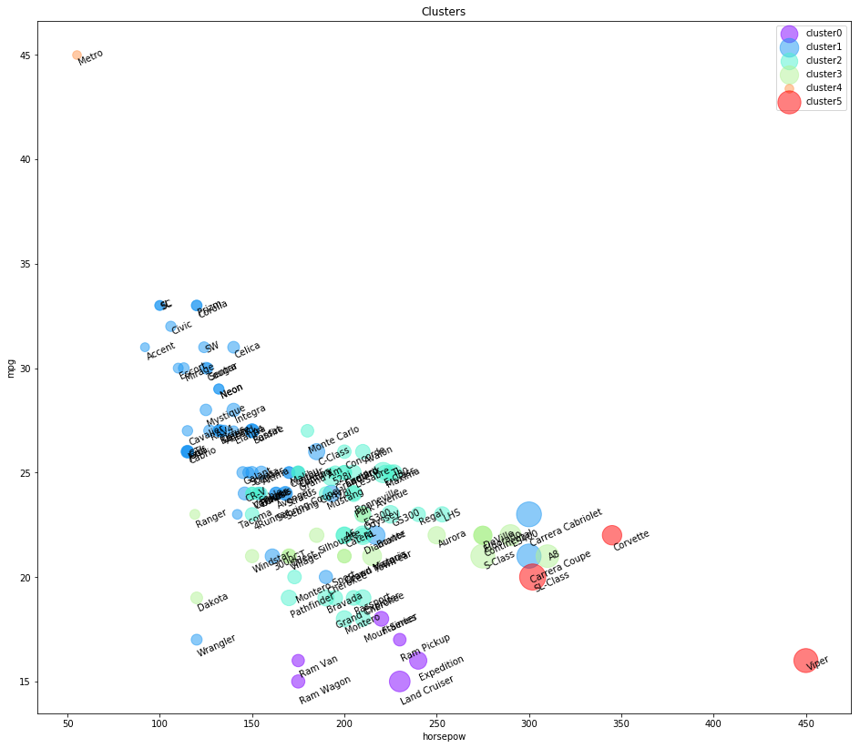
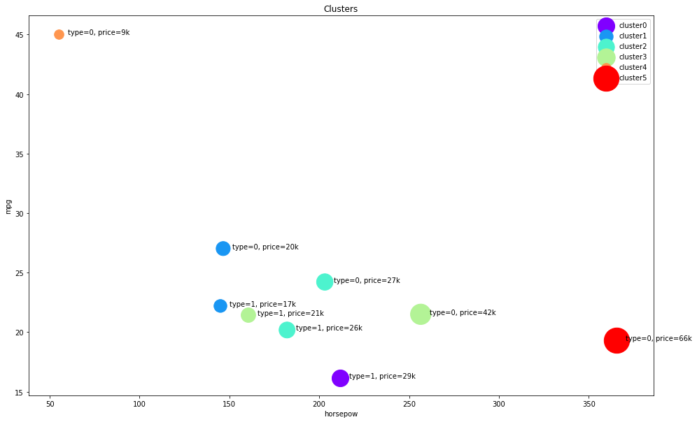
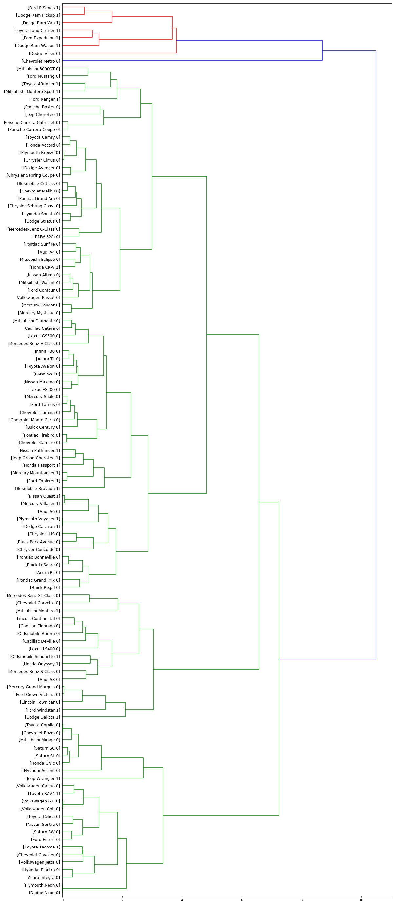

```python
import pandas as pd
import numpy as np
from matplotlib import pyplot as plt
from sklearn.cluster import AgglomerativeClustering
%matplotlib inline
```


```python
dat=pd.read_csv('https://s3-api.us-geo.objectstorage.softlayer.net/cf-courses-data/CognitiveClass/ML0101ENv3/labs/cars_clus.csv')
```


```python
print('Shape of the dataset', dat.shape)
dat.head(5)
```

    Shape of the dataset (159, 16)


<div>
<style scoped>
    .dataframe tbody tr th:only-of-type {
        vertical-align: middle;
    }

    .dataframe tbody tr th {
        vertical-align: top;
    }

    .dataframe thead th {
        text-align: right;
    }
</style>
<table border="1" class="dataframe">
  <thead>
    <tr style="text-align: right;">
      <th></th>
      <th>manufact</th>
      <th>model</th>
      <th>sales</th>
      <th>resale</th>
      <th>type</th>
      <th>price</th>
      <th>engine_s</th>
      <th>horsepow</th>
      <th>wheelbas</th>
      <th>width</th>
      <th>length</th>
      <th>curb_wgt</th>
      <th>fuel_cap</th>
      <th>mpg</th>
      <th>lnsales</th>
      <th>partition</th>
    </tr>
  </thead>
  <tbody>
    <tr>
      <th>0</th>
      <td>Acura</td>
      <td>Integra</td>
      <td>16.919</td>
      <td>16.360</td>
      <td>0.000</td>
      <td>21.500</td>
      <td>1.800</td>
      <td>140.000</td>
      <td>101.200</td>
      <td>67.300</td>
      <td>172.400</td>
      <td>2.639</td>
      <td>13.200</td>
      <td>28.000</td>
      <td>2.828</td>
      <td>0.0</td>
    </tr>
    <tr>
      <th>1</th>
      <td>Acura</td>
      <td>TL</td>
      <td>39.384</td>
      <td>19.875</td>
      <td>0.000</td>
      <td>28.400</td>
      <td>3.200</td>
      <td>225.000</td>
      <td>108.100</td>
      <td>70.300</td>
      <td>192.900</td>
      <td>3.517</td>
      <td>17.200</td>
      <td>25.000</td>
      <td>3.673</td>
      <td>0.0</td>
    </tr>
    <tr>
      <th>2</th>
      <td>Acura</td>
      <td>CL</td>
      <td>14.114</td>
      <td>18.225</td>
      <td>0.000</td>
      <td>$null$</td>
      <td>3.200</td>
      <td>225.000</td>
      <td>106.900</td>
      <td>70.600</td>
      <td>192.000</td>
      <td>3.470</td>
      <td>17.200</td>
      <td>26.000</td>
      <td>2.647</td>
      <td>0.0</td>
    </tr>
    <tr>
      <th>3</th>
      <td>Acura</td>
      <td>RL</td>
      <td>8.588</td>
      <td>29.725</td>
      <td>0.000</td>
      <td>42.000</td>
      <td>3.500</td>
      <td>210.000</td>
      <td>114.600</td>
      <td>71.400</td>
      <td>196.600</td>
      <td>3.850</td>
      <td>18.000</td>
      <td>22.000</td>
      <td>2.150</td>
      <td>0.0</td>
    </tr>
    <tr>
      <th>4</th>
      <td>Audi</td>
      <td>A4</td>
      <td>20.397</td>
      <td>22.255</td>
      <td>0.000</td>
      <td>23.990</td>
      <td>1.800</td>
      <td>150.000</td>
      <td>102.600</td>
      <td>68.200</td>
      <td>178.000</td>
      <td>2.998</td>
      <td>16.400</td>
      <td>27.000</td>
      <td>3.015</td>
      <td>0.0</td>
    </tr>
  </tbody>
</table>
</div>


```python
##Data cleaning
print('Number of elements of dataset', dat.size)
col=list(dat)
print(col)
```

    Number of elements of dataset 2544
    ['manufact', 'model', 'sales', 'resale', 'type', 'price', 'engine_s', 'horsepow', 'wheelbas', 'width', 'length', 'curb_wgt', 'fuel_cap', 'mpg', 'lnsales', 'partition']


```python
dat[col[2:len(col)-1]]=dat[col[2:len(col)-1]].apply(pd.to_numeric,errors='coerce') ##convert any strings to NaN
```


```python
dat=dat.dropna()
dat=dat.reset_index(drop=True)
print('Shape of dataset after cleaning',dat.shape)
dat.head(5)
```

    Shape of dataset after cleaning (117, 16)


<div>
<style scoped>
    .dataframe tbody tr th:only-of-type {
        vertical-align: middle;
    }

    .dataframe tbody tr th {
        vertical-align: top;
    }

    .dataframe thead th {
        text-align: right;
    }
</style>
<table border="1" class="dataframe">
  <thead>
    <tr style="text-align: right;">
      <th></th>
      <th>manufact</th>
      <th>model</th>
      <th>sales</th>
      <th>resale</th>
      <th>type</th>
      <th>price</th>
      <th>engine_s</th>
      <th>horsepow</th>
      <th>wheelbas</th>
      <th>width</th>
      <th>length</th>
      <th>curb_wgt</th>
      <th>fuel_cap</th>
      <th>mpg</th>
      <th>lnsales</th>
      <th>partition</th>
    </tr>
  </thead>
  <tbody>
    <tr>
      <th>0</th>
      <td>Acura</td>
      <td>Integra</td>
      <td>16.919</td>
      <td>16.360</td>
      <td>0.0</td>
      <td>21.50</td>
      <td>1.8</td>
      <td>140.0</td>
      <td>101.2</td>
      <td>67.3</td>
      <td>172.4</td>
      <td>2.639</td>
      <td>13.2</td>
      <td>28.0</td>
      <td>2.828</td>
      <td>0.0</td>
    </tr>
    <tr>
      <th>1</th>
      <td>Acura</td>
      <td>TL</td>
      <td>39.384</td>
      <td>19.875</td>
      <td>0.0</td>
      <td>28.40</td>
      <td>3.2</td>
      <td>225.0</td>
      <td>108.1</td>
      <td>70.3</td>
      <td>192.9</td>
      <td>3.517</td>
      <td>17.2</td>
      <td>25.0</td>
      <td>3.673</td>
      <td>0.0</td>
    </tr>
    <tr>
      <th>2</th>
      <td>Acura</td>
      <td>RL</td>
      <td>8.588</td>
      <td>29.725</td>
      <td>0.0</td>
      <td>42.00</td>
      <td>3.5</td>
      <td>210.0</td>
      <td>114.6</td>
      <td>71.4</td>
      <td>196.6</td>
      <td>3.850</td>
      <td>18.0</td>
      <td>22.0</td>
      <td>2.150</td>
      <td>0.0</td>
    </tr>
    <tr>
      <th>3</th>
      <td>Audi</td>
      <td>A4</td>
      <td>20.397</td>
      <td>22.255</td>
      <td>0.0</td>
      <td>23.99</td>
      <td>1.8</td>
      <td>150.0</td>
      <td>102.6</td>
      <td>68.2</td>
      <td>178.0</td>
      <td>2.998</td>
      <td>16.4</td>
      <td>27.0</td>
      <td>3.015</td>
      <td>0.0</td>
    </tr>
    <tr>
      <th>4</th>
      <td>Audi</td>
      <td>A6</td>
      <td>18.780</td>
      <td>23.555</td>
      <td>0.0</td>
      <td>33.95</td>
      <td>2.8</td>
      <td>200.0</td>
      <td>108.7</td>
      <td>76.1</td>
      <td>192.0</td>
      <td>3.561</td>
      <td>18.5</td>
      <td>22.0</td>
      <td>2.933</td>
      <td>0.0</td>
    </tr>
  </tbody>
</table>
</div>


```python
##feature selection
featureset = dat[['engine_s',  'horsepow', 'wheelbas', 'width', 'length', 'curb_wgt', 'fuel_cap', 'mpg']]
```


```python
from sklearn.preprocessing import MinMaxScaler
from sklearn.metrics import pairwise_distances
# x = featureset.values #returns a numpy array
min_max_scaler = MinMaxScaler()
feature_mtx = min_max_scaler.fit_transform(featureset)
# feature_mtx = min_max_scaler.fit_transform(x)
feature_mtx [0:5]
pairs=pairwise_distances(feature_mtx)
print(pairs)

agglom = AgglomerativeClustering(n_clusters = 6, linkage = 'complete')
agglom.fit(feature_mtx)
agglom.labels_
dat['cluster'] = agglom.labels_
dat.head()
```

    [[0.         0.57777143 0.75455727 ... 0.28530295 0.24917241 0.18879995]
     [0.57777143 0.         0.22798938 ... 0.36087756 0.66346677 0.62201282]
     [0.75455727 0.22798938 0.         ... 0.51727787 0.81786095 0.77930119]
     ...
     [0.28530295 0.36087756 0.51727787 ... 0.         0.41797928 0.35720492]
     [0.24917241 0.66346677 0.81786095 ... 0.41797928 0.         0.15212198]
     [0.18879995 0.62201282 0.77930119 ... 0.35720492 0.15212198 0.        ]]


<div>
<style scoped>
    .dataframe tbody tr th:only-of-type {
        vertical-align: middle;
    }

    .dataframe tbody tr th {
        vertical-align: top;
    }

    .dataframe thead th {
        text-align: right;
    }
</style>
<table border="1" class="dataframe">
  <thead>
    <tr style="text-align: right;">
      <th></th>
      <th>manufact</th>
      <th>model</th>
      <th>sales</th>
      <th>resale</th>
      <th>type</th>
      <th>price</th>
      <th>engine_s</th>
      <th>horsepow</th>
      <th>wheelbas</th>
      <th>width</th>
      <th>length</th>
      <th>curb_wgt</th>
      <th>fuel_cap</th>
      <th>mpg</th>
      <th>lnsales</th>
      <th>partition</th>
      <th>cluster</th>
    </tr>
  </thead>
  <tbody>
    <tr>
      <th>0</th>
      <td>Acura</td>
      <td>Integra</td>
      <td>16.919</td>
      <td>16.360</td>
      <td>0.0</td>
      <td>21.50</td>
      <td>1.8</td>
      <td>140.0</td>
      <td>101.2</td>
      <td>67.3</td>
      <td>172.4</td>
      <td>2.639</td>
      <td>13.2</td>
      <td>28.0</td>
      <td>2.828</td>
      <td>0.0</td>
      <td>1</td>
    </tr>
    <tr>
      <th>1</th>
      <td>Acura</td>
      <td>TL</td>
      <td>39.384</td>
      <td>19.875</td>
      <td>0.0</td>
      <td>28.40</td>
      <td>3.2</td>
      <td>225.0</td>
      <td>108.1</td>
      <td>70.3</td>
      <td>192.9</td>
      <td>3.517</td>
      <td>17.2</td>
      <td>25.0</td>
      <td>3.673</td>
      <td>0.0</td>
      <td>2</td>
    </tr>
    <tr>
      <th>2</th>
      <td>Acura</td>
      <td>RL</td>
      <td>8.588</td>
      <td>29.725</td>
      <td>0.0</td>
      <td>42.00</td>
      <td>3.5</td>
      <td>210.0</td>
      <td>114.6</td>
      <td>71.4</td>
      <td>196.6</td>
      <td>3.850</td>
      <td>18.0</td>
      <td>22.0</td>
      <td>2.150</td>
      <td>0.0</td>
      <td>2</td>
    </tr>
    <tr>
      <th>3</th>
      <td>Audi</td>
      <td>A4</td>
      <td>20.397</td>
      <td>22.255</td>
      <td>0.0</td>
      <td>23.99</td>
      <td>1.8</td>
      <td>150.0</td>
      <td>102.6</td>
      <td>68.2</td>
      <td>178.0</td>
      <td>2.998</td>
      <td>16.4</td>
      <td>27.0</td>
      <td>3.015</td>
      <td>0.0</td>
      <td>1</td>
    </tr>
    <tr>
      <th>4</th>
      <td>Audi</td>
      <td>A6</td>
      <td>18.780</td>
      <td>23.555</td>
      <td>0.0</td>
      <td>33.95</td>
      <td>2.8</td>
      <td>200.0</td>
      <td>108.7</td>
      <td>76.1</td>
      <td>192.0</td>
      <td>3.561</td>
      <td>18.5</td>
      <td>22.0</td>
      <td>2.933</td>
      <td>0.0</td>
      <td>2</td>
    </tr>
  </tbody>
</table>
</div>


```python
import matplotlib.cm as cm
n_clusters = max(agglom.labels_)+1
colors = cm.rainbow(np.linspace(0, 1, n_clusters))
cluster_labels = list(range(0, n_clusters))

# Create a figure of size 6 inches by 4 inches.
plt.figure(figsize=(16,14))

for color, label in zip(colors, cluster_labels):
    subset = dat[dat.cluster == label]
    for i in subset.index:
            plt.text(subset.horsepow[i], subset.mpg[i],str(subset['model'][i]), rotation=25) 
    plt.scatter(subset.horsepow, subset.mpg, s= subset.price*10, c=color, label='cluster'+str(label),alpha=0.5)
#    plt.scatter(subset.horsepow, subset.mpg)
plt.legend()
plt.title('Clusters')
plt.xlabel('horsepow')
plt.ylabel('mpg')
plt.show()
```

    'c' argument looks like a single numeric RGB or RGBA sequence, which should be avoided as value-mapping will have precedence in case its length matches with 'x' & 'y'.  Please use a 2-D array with a single row if you really want to specify the same RGB or RGBA value for all points.
    'c' argument looks like a single numeric RGB or RGBA sequence, which should be avoided as value-mapping will have precedence in case its length matches with 'x' & 'y'.  Please use a 2-D array with a single row if you really want to specify the same RGB or RGBA value for all points.
    'c' argument looks like a single numeric RGB or RGBA sequence, which should be avoided as value-mapping will have precedence in case its length matches with 'x' & 'y'.  Please use a 2-D array with a single row if you really want to specify the same RGB or RGBA value for all points.
    'c' argument looks like a single numeric RGB or RGBA sequence, which should be avoided as value-mapping will have precedence in case its length matches with 'x' & 'y'.  Please use a 2-D array with a single row if you really want to specify the same RGB or RGBA value for all points.
    'c' argument looks like a single numeric RGB or RGBA sequence, which should be avoided as value-mapping will have precedence in case its length matches with 'x' & 'y'.  Please use a 2-D array with a single row if you really want to specify the same RGB or RGBA value for all points.
    'c' argument looks like a single numeric RGB or RGBA sequence, which should be avoided as value-mapping will have precedence in case its length matches with 'x' & 'y'.  Please use a 2-D array with a single row if you really want to specify the same RGB or RGBA value for all points.





As you can see, we are seeing the distribution of each cluster using the scatter plot, but it is not very clear where is the centroid of each cluster. Moreover, there are 2 types of vehicles in our dataset, "truck" (value of 1 in the type column) and "car" (value of 0 in the type column). So, we use them to distinguish the classes, and summarize the cluster.


```python
dat.groupby(['cluster','type'])['cluster'].count()

```


    cluster  type
    0        1.0      6
    1        0.0     47
             1.0      5
    2        0.0     27
             1.0     11
    3        0.0     10
             1.0      7
    4        0.0      1
    5        0.0      3
    Name: cluster, dtype: int64


```python
agg_cars = dat.groupby(['cluster','type'])['horsepow','engine_s','mpg','price'].mean()
agg_cars
```


<div>
<style scoped>
    .dataframe tbody tr th:only-of-type {
        vertical-align: middle;
    }

    .dataframe tbody tr th {
        vertical-align: top;
    }

    .dataframe thead th {
        text-align: right;
    }
</style>
<table border="1" class="dataframe">
  <thead>
    <tr style="text-align: right;">
      <th></th>
      <th></th>
      <th>horsepow</th>
      <th>engine_s</th>
      <th>mpg</th>
      <th>price</th>
    </tr>
    <tr>
      <th>cluster</th>
      <th>type</th>
      <th></th>
      <th></th>
      <th></th>
      <th></th>
    </tr>
  </thead>
  <tbody>
    <tr>
      <th>0</th>
      <th>1.0</th>
      <td>211.666667</td>
      <td>4.483333</td>
      <td>16.166667</td>
      <td>29.024667</td>
    </tr>
    <tr>
      <th rowspan="2" valign="top">1</th>
      <th>0.0</th>
      <td>146.531915</td>
      <td>2.246809</td>
      <td>27.021277</td>
      <td>20.306128</td>
    </tr>
    <tr>
      <th>1.0</th>
      <td>145.000000</td>
      <td>2.580000</td>
      <td>22.200000</td>
      <td>17.009200</td>
    </tr>
    <tr>
      <th rowspan="2" valign="top">2</th>
      <th>0.0</th>
      <td>203.111111</td>
      <td>3.303704</td>
      <td>24.214815</td>
      <td>27.750593</td>
    </tr>
    <tr>
      <th>1.0</th>
      <td>182.090909</td>
      <td>3.345455</td>
      <td>20.181818</td>
      <td>26.265364</td>
    </tr>
    <tr>
      <th rowspan="2" valign="top">3</th>
      <th>0.0</th>
      <td>256.500000</td>
      <td>4.410000</td>
      <td>21.500000</td>
      <td>42.870400</td>
    </tr>
    <tr>
      <th>1.0</th>
      <td>160.571429</td>
      <td>3.071429</td>
      <td>21.428571</td>
      <td>21.527714</td>
    </tr>
    <tr>
      <th>4</th>
      <th>0.0</th>
      <td>55.000000</td>
      <td>1.000000</td>
      <td>45.000000</td>
      <td>9.235000</td>
    </tr>
    <tr>
      <th>5</th>
      <th>0.0</th>
      <td>365.666667</td>
      <td>6.233333</td>
      <td>19.333333</td>
      <td>66.010000</td>
    </tr>
  </tbody>
</table>
</div>


__Cars__:
- Cluster 1: with almost high mpg, and low in horsepower.
- Cluster 2: with good mpg and horsepower, but higher price than average.
- Cluster 3: with low mpg, high horsepower, highest price.
    
    
    
__Trucks__:
- Cluster 1: with almost highest mpg among trucks, and lowest in horsepower and price.
- Cluster 2: with almost low mpg and medium horsepower, but higher price than average.
- Cluster 3: with good mpg and horsepower, low price.


Please notice that we did not use __type__ , and __price__ of cars in the clustering process, but Hierarchical clustering could forge the clusters and discriminate them with quite high accuracy.


```python
plt.figure(figsize=(16,10))
for color, label in zip(colors, cluster_labels):
    subset = agg_cars.loc[(label,),]
    for i in subset.index:
        plt.text(subset.loc[i][0]+5, subset.loc[i][2], 'type='+str(int(i)) + ', price='+str(int(subset.loc[i][3]))+'k')
    plt.scatter(subset.horsepow, subset.mpg, s=subset.price*20, c=color, label='cluster'+str(label))
plt.legend()
plt.title('Clusters')
plt.xlabel('horsepow')
plt.ylabel('mpg')

```

    'c' argument looks like a single numeric RGB or RGBA sequence, which should be avoided as value-mapping will have precedence in case its length matches with 'x' & 'y'.  Please use a 2-D array with a single row if you really want to specify the same RGB or RGBA value for all points.
    'c' argument looks like a single numeric RGB or RGBA sequence, which should be avoided as value-mapping will have precedence in case its length matches with 'x' & 'y'.  Please use a 2-D array with a single row if you really want to specify the same RGB or RGBA value for all points.
    'c' argument looks like a single numeric RGB or RGBA sequence, which should be avoided as value-mapping will have precedence in case its length matches with 'x' & 'y'.  Please use a 2-D array with a single row if you really want to specify the same RGB or RGBA value for all points.
    'c' argument looks like a single numeric RGB or RGBA sequence, which should be avoided as value-mapping will have precedence in case its length matches with 'x' & 'y'.  Please use a 2-D array with a single row if you really want to specify the same RGB or RGBA value for all points.
    'c' argument looks like a single numeric RGB or RGBA sequence, which should be avoided as value-mapping will have precedence in case its length matches with 'x' & 'y'.  Please use a 2-D array with a single row if you really want to specify the same RGB or RGBA value for all points.
    'c' argument looks like a single numeric RGB or RGBA sequence, which should be avoided as value-mapping will have precedence in case its length matches with 'x' & 'y'.  Please use a 2-D array with a single row if you really want to specify the same RGB or RGBA value for all points.


    Text(0, 0.5, 'mpg')





# Scipy


```python
##scipy
import scipy
leng = feature_mtx.shape[0]
D = scipy.zeros([leng,leng])
for i in range(leng):
    for j in range(leng):
        D[i,j] = scipy.spatial.distance.euclidean(feature_mtx[i], feature_mtx[j])
```


```python
import pylab
from scipy.cluster import hierarchy
Z = hierarchy.linkage(D, 'complete')
```


```python
from scipy.cluster.hierarchy import fcluster
max_d = 3 #distance between points
clusters = fcluster(Z, max_d, criterion='distance')
print(clusters)
from scipy.cluster.hierarchy import fcluster
k = 5 #n_clusters
clusters = fcluster(Z, k, criterion='maxclust')
print(clusters)

```

    [ 1  5  5  6  5  4  6  5  5  5  5  5  4  4  5  1  6  5  5  5  4  2 11  6
      6  5  6  5  1  6  6 10  9  8  9  3  5  1  7  6  5  3  5  3  8  7  9  2
      6  6  5  4  2  1  6  5  2  7  5  5  5  4  4  3  2  6  6  5  7  4  7  6
      6  5  3  5  5  6  5  4  4  1  6  5  5  5  6  4  5  4  1  6  5  6  6  5
      5  5  7  7  7  2  2  1  2  6  5  1  1  1  7  8  1  1  6  1  1]
    [1 3 3 3 3 2 3 3 3 3 3 3 2 2 3 1 3 3 3 3 2 1 5 3 3 3 3 3 1 3 3 4 4 4 4 2 3
     1 3 3 3 2 3 2 4 3 4 1 3 3 3 2 1 1 3 3 1 3 3 3 3 2 2 2 1 3 3 3 3 2 3 3 3 3
     2 3 3 3 3 2 2 1 3 3 3 3 3 2 3 2 1 3 3 3 3 3 3 3 3 3 3 1 1 1 1 3 3 1 1 1 3
     4 1 1 3 1 1]


```python
fig = pylab.figure(figsize=(18,50))
def llf(id):
    return '[%s %s %s]' % (dat['manufact'][id], dat['model'][id], int(float(dat['type'][id])) )
    
dendro = hierarchy.dendrogram(Z,  leaf_label_func=llf, leaf_rotation=0, leaf_font_size =12, orientation = 'right')
```





```python
#scipy
from scipy.spatial import distance_matrix 
dist_matrix = distance_matrix(feature_mtx,feature_mtx) 
print(dist_matrix)

```

    [[0.         0.57777143 0.75455727 ... 0.28530295 0.24917241 0.18879995]
     [0.57777143 0.         0.22798938 ... 0.36087756 0.66346677 0.62201282]
     [0.75455727 0.22798938 0.         ... 0.51727787 0.81786095 0.77930119]
     ...
     [0.28530295 0.36087756 0.51727787 ... 0.         0.41797928 0.35720492]
     [0.24917241 0.66346677 0.81786095 ... 0.41797928 0.         0.15212198]
     [0.18879995 0.62201282 0.77930119 ... 0.35720492 0.15212198 0.        ]]

